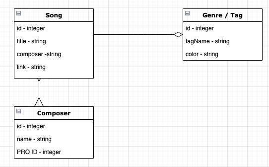
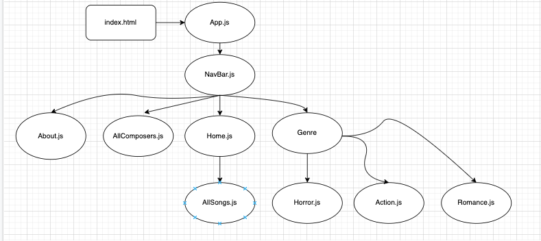

# Music Library - Capstone Project


## Overview

Music supervision is the field where musician and filmmakers (and TV) intersect. It is often frought with technological issues. Create a website that provides all the necessary information for musicians to get paid and directors to find the right music while pairing music with genre tags.

## Objectives

Create a professional-looking, full-stack application with functioning front and back end. Using primarily Mongoose, Express, React, and Javascript you will create a custom API on the backend and active React forms on the front end. The application should have no less than 3 models and full CRUD operations.

## Instructions

Get started:

```js
-start mongo server
-start a mongo shell
-npm init -y
-npm install mongoose
-mkdir db models seed
-touch db/index.js models/album.js seed/albums.js
```

Next Steps:

```js
-Establish a Database connection
-Establish schemas for what for album reviews will look like
-Install and deploy Express and Nodemon:
-npm install express
-npm install nodemon --save-dev
-Set up express folders and the root route
-Test the route
-Use Insomnia to ensure successful connection
-Employ React forms
-Make sure React forms are working and the objects are being updated via CRUD
-Add albums reviews to your hearts content
```

## Componenet Diagram

```
ERD:
```



```
CHD:
```



## Links

Trello Board: [trello](https://trello.com/b/XTH5UxGd/royal-music-library)
